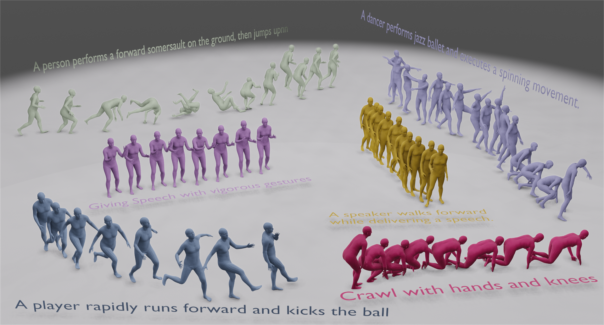

# **MCM: Multi-condition Motion Synthesis Framework**


<p align="center">
  <a href='https://arxiv.org/pdf/2404.12886'>
    
  </a>
  <a href='https://fluide1022.github.io/MCM/'>
  </a>
  <!-- <a href='https://youtu.be/0a0ZYJgzdWE'>
  </a> -->
  <a href='https://github.com/fluide1022/MCM'>
    </a>
</p>

<p align="center">
<!-- <h1 align="center">InterDiff: Generating 3D Human-Object Interactions with Physics-Informed Diffusion</h1> -->
<strong>MCM: Multi-condition Motion Synthesis Framework</strong></h1>
   <p align="center">
    <a href='https://scholar.google.be/citations?hl=nl&user=znEflnQAAAAJ&view_op=list_works&gmla=AOAOcb2TR7qEXM6UaMoS2X58UZTBNRqgsZuX5pVg44IH3QjDY34EcXsYR1ulftMWcE4I2NDA6-JqCvBmLANJgCfgDvkD' target='_blank'>Zeyu Ling*</a>&emsp;
    <a href='' target='_blank'>Bo Han*</a>&emsp;
    <a href='https://scholar.google.com/citations?user=Xa0mxggAAAAJ&hl=zh-CN' target='_blank'>Yongkang Wong</a>&emsp;
    <a href='https://www.comp.nus.edu.sg/~mohan/' target='_blank'>Mohan Kangkanhalli</a>&emsp;
    <a href='https://person.zju.edu.cn/0095152/' target='_blank'>Weidong Geng</a>&emsp;
    <br>
    Zhejiang University&emsp;
    National University of Singapore
    <br>
    MCM was accepted by IJCAI2024.
  </p>
</p>


## 💻 Project Page

<p align="center">
  <a href='https://fluide1022.github.io/MCM/'>
  		</a>
</p>


## 📜 TODO List

- [x] Release the main codes for implementation.
- [x] Release the demo video.

## ⚙️ Implementation

We come up with mmotion, together with MCM implementation and other Motion models/
Please refer to <a href='https://github.com/ZeyuLing/MotionLLaMA'>

## 🤝 Citation

If you find this repository useful for your work, please consider citing it as follows:

```
@inproceedings{2024mcm,
  title     = {MCM: Multi-condition Motion Synthesis Framework},
  author    = {Ling, Zeyu and Han, Bo and Wong, Yongkang and Lin, Han and Kankanhalli, Mohan and Geng, Weidong},
  booktitle = {Proceedings of the Thirty-Third International Joint Conference on
               Artificial Intelligence, {IJCAI-24}},
  publisher = {International Joint Conferences on Artificial Intelligence Organization},
  editor    = {Kate Larson},
  pages     = {1083--1091},
  year      = {2024},
  month     = {8},
  note      = {Main Track},
  doi       = {10.24963/ijcai.2024/120},
  url       = {https://doi.org/10.24963/ijcai.2024/120},
}

```
